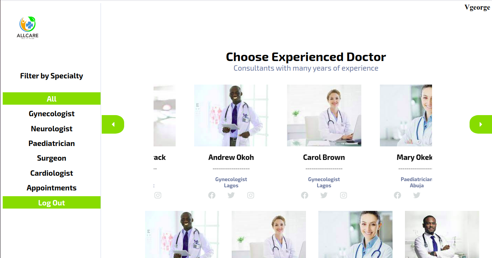
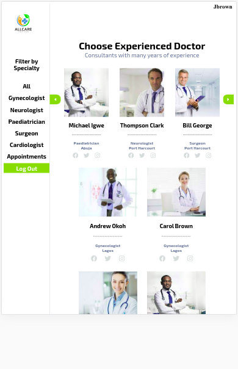
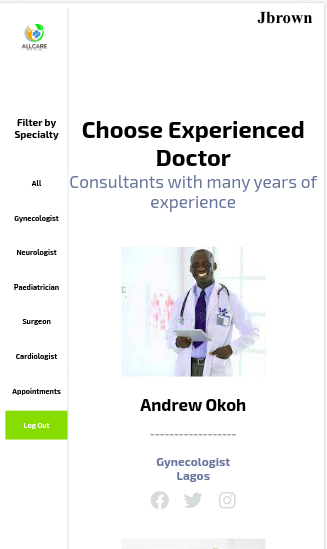

# Book Appointment App
This is an app for booking appointments with a doctor. This front-end is built with react and redux. It connects to a backend API built with Ruby and rails which is hosted on Heroku. It fetches and sends data to the back-end using this API. The main function of this application is to display a list of doctor with different specialties, displays information about them and allow users to book an appointment with any doctor of their choice. Details like the doctor's full name, specialization, years of experience, location, email, phone number are displayed when users click on the picture of any doctor of their choice. From the doctor details page, the user can book an appointment with that doctor if he so wishes by clicking on the book appointment button. This opens a form that is auto-filled with the doctor's full name. The user will now select the date and doctor's location and submit his form. Users can go back to the home page by clicking on the HOME button on the left side of the page. He can also see a list of all appointments he has booked with different doctors by clicking on the appointments button still on the left column. On the home page, you filter doctors based on a specialty to make selection easy. The application pulls the information about the doctors from the backend API which I built and hosted separately on Heroku. This application is fully responsive.
NB: The doctors' pictures are free pictures selected from the internet and stored in the picture storing site [Imgur](https://imgur.com/). The picture links are now used as a string in this project. I have a plan of adding more features to this app in the future as well as create an admin dashboard for adding doctor details.

## Main Features
- Users can see a list of doctors and their specialties.
- User can filter the list based on specialty.
- User can see details of each doctor.
- User can book appointments with any doctor on display.
- User can delete or edit booked appointment.
- User can register or create an account.
- Registered users can log in with their username and password.

## Preview

## Cover Page


## Home Page


## Detail Page


## Apointment List Page


## Tablet View Page


## Mobile View


## Project SetUp
Get a local copy of the file. Clone with HTTPS following the steps below.

### For Windows
- In your search box, type cmd, click on cmd to open the command prompt.

### For Linux, Mac OS
- In your search box, type terminal, click on the terminal to launch it.

- Copy and paste the command below in your terminal and press enter from your keyboard.
```
git clone https://github.com/Zubenna/doctor-appointment-app.git
```
## Access Project Folder 
- Depending on where the project files are downloaded to, either Hard Disk(HDD), Desktop or Documents directory in your computer after completing the step above.
- Double click on the folder doctor-appointment-app to open it.
- Inside the folder, right-click and click on terminal or cmd depending on your Operating System to open it.

## Set Up Project Locally in Your Computer
- In the cmd or terminal, type the command below;
```
npm install
```
- Wait for some time to install all the app packages and dependencies.
- Once the installation is completed.
- Type the command below in your cmd or terminal to start the project locally. Wait for some time.
```
npm start
```
- Once the server is fully started, you will see the project opening a different tab on your browser at port http://localhost:3000/. The page now displays the Book appointment with a doctor app. You can register as a new user or log in to use this app.

## Project Test

Run tests written for this project by entering this command in the root of this project.
```
npm test
```
## Live Version
Launch live version.
- [Launch App](https://book-a-doctor.netlify.app/)
Login with
- username: Jbrown
- password: memeee
Or Register.

## Built With (Packages and tools)
- React
- JavaScript
- React-DOM
- React-Create-App
- Redux
- npm
- [doc-appointment-api](https://stormy-badlands-31674.herokuapp.com/)
- Axios
- PropTypes
- ES6
- Jest
- Enzyme
- CSS modules
- React Testing Library
- Eslint
- Stylelint
- VScode

## Author
👤 **Nnamdi Emelu**
- Github: [zubenna](https://github.com/zubenna)
- Twitter: [@zubenna](https://twitter.com/zubenna)
- Linkedin: [nnamdi-emelu](https://www.linkedin.com/in/nnamdi-emelu/)

## 🤝 Contributing
Contributions, issues, and feature requests are welcome!
Feel free to check the [issues page](https://github.com/Zubenna/doctor-appointment-app/issues)

## 👍 Show Your Support
Kindly star ⭐️ this project, if you like it!

## :clap: Acknowledgements
- Murat Korkmaz on Behance - For UI Design inspiration.
- [Microverse](https://www.microverse.org/)

## 📝 License
This project is [MIT](LICENSE) licensed.
